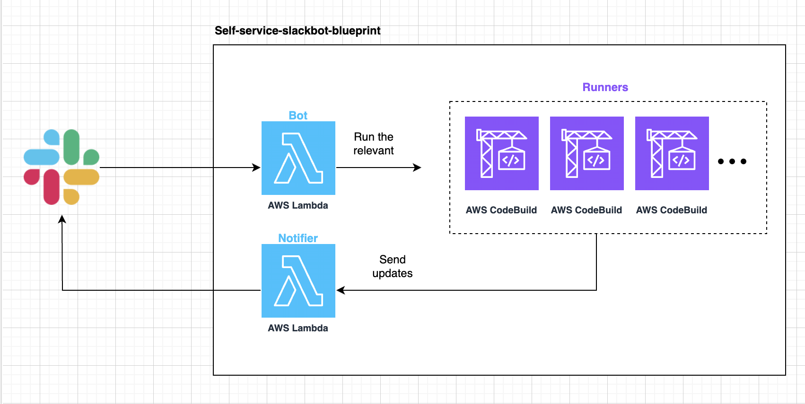

# 🤖 Self-Service Slack Bot Blueprint

  

This project enables you to create and extend a Slack bot with custom actions using AWS services.  
It allows you to add actions easily by simply creating a folder in the `actions` directory.  
Each action folder includes:  
- `modal.json` → Defines the form displayed to users.  
- `buildspec.yaml` → Defines the backend commands executed by AWS CodeBuild.  

---

## 📁 Project Structure

This project consists of three main components:

### 1. `bot/`
- Contains the Python source code for the Slack bot.
- Includes `template.yaml` for deployment.
- Reads configurations from the `actions/` folder to present actions to users.

### 2. `runners/`
- Contains Terraform code to create AWS CodeBuild projects for each action.
- Each project corresponds to an action and executes the respective `buildspec.yaml`.

### 3. `bot/src/slack_bot/actions/`
- Contains individual action folders.
- Each action folder must include:  
  - `modal.json` – Defines the Slack modal UI.  
  - `buildspec.yaml` – Defines the backend execution logic.

---

## ✨ How to Add a New Action

1. **Create an Action Folder**  
   - Under `bot/src/slack_bot/actions/`, create a new folder (action name should be without spaces).
   - This name will be used for:
     - The AWS CodeBuild project.
     - The corresponding action in the Slack bot.

2. **Define `modal.json`**  
   - Use the [Slack Block Kit Builder](https://api.slack.com/tools/block-kit-builder) to create the modal UI.  
   - Save the JSON structure in `modal.json` inside the action folder.

3. **Define `buildspec.yaml`**  
   - This file contains the commands executed by AWS CodeBuild.  
   - Define automation logic such as provisioning resources, executing scripts, or running other tasks.

---

## ⚙️ How the Bot Works

1. The bot presents a list of available actions based on the folders in the `actions/` directory.
2. When a user selects an action, the corresponding `modal.json` is displayed.
3. After submission, the bot triggers the AWS CodeBuild project defined in `buildspec.yaml`.

### 🔧 Customizing Actions
- Modify `modal.json` to change the form fields.
- Update `buildspec.yaml` to adjust the backend logic.

For more details on modals, check the [Slack Block Kit Builder](https://api.slack.com/tools/block-kit-builder).

---

## 📦 Deployment

- Run the following command to deploy the bot and infrastructure:  
  ```sh
  make all
  ```
  This will:

 - Deploy the CloudFormation stack (including the bot function and notifier function).
 - Create the AWS CodeBuild projects ("Runners") using Terraform.

---

## 🤝 Contributing
Contributions are welcome!
Fork the repository and submit a pull request with bug fixes, improvements, or new features.

For more details, reach out to the repository owner.
Visit [Senora.dev](https://Senora.dev)💜 for more platform-related services.
